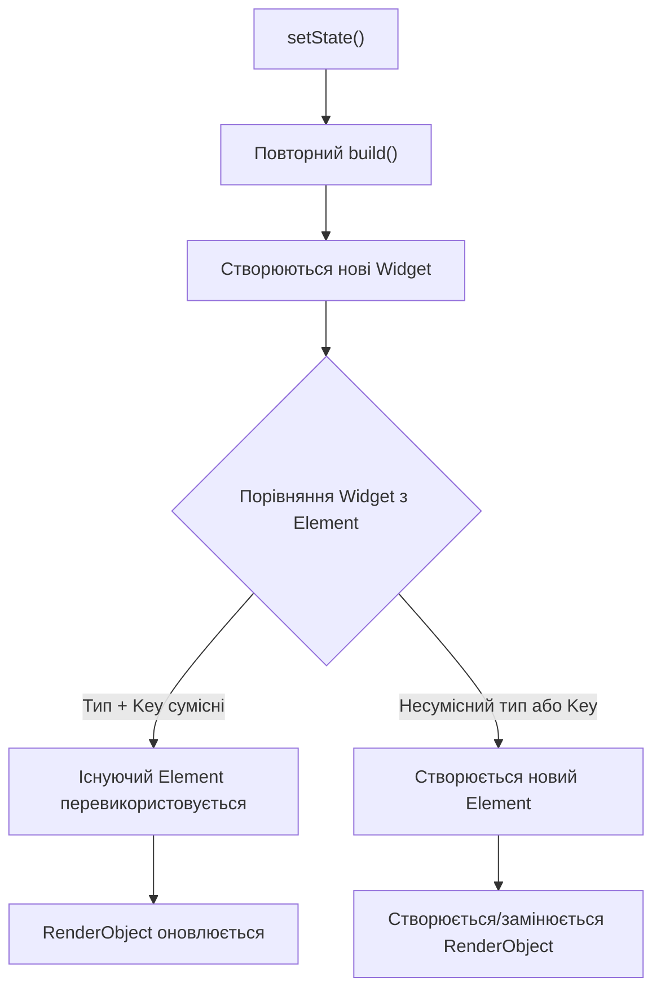
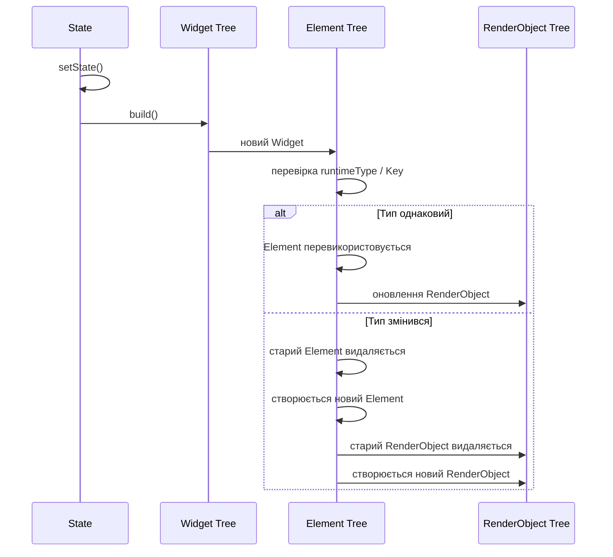
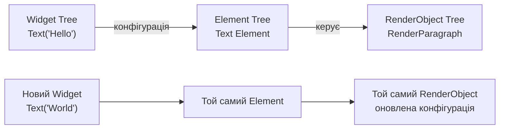

# Practice2
# Практична робота 2: Технологія Flutter

**Тема:** Технологія Flutter
**Варіант:** 1 — Три дерева Flutter

## Мета роботи

Дослідити взаємодію трьох основних дерев Flutter — `Widget`, `Element` та `RenderObject`, а також з'ясувати, що відбувається з ними під час виклику `setState()` і зміни типу віджета.

---

# 1. Теоретичні відомості

Flutter використовує три пов'язані між собою структури:

* **Widget Tree** — описує конфігурацію інтерфейсу;
* **Element Tree** — зберігає зв'язок між конфігурацією Widget та її місцем у дереві;
* **RenderObject Tree** — відповідає за layout, малювання та взаємодію з графічним середовищем.

Важливо, що `Widget` є незмінним описом інтерфейсу. Під час перебудови Flutter може створити нові об'єкти `Widget`, але це не означає, що всі відповідні `Element` та `RenderObject` будуть створені заново.

---

# 2. Мінімальний приклад зі зміною тексту

У першому прикладі натискання кнопки викликає `setState()`, після чого змінюється текст.

```dart
import 'package:flutter/material.dart';

void main() {
  runApp(const MaterialApp(
    home: CounterPage(),
  ));
}

class CounterPage extends StatefulWidget {
  const CounterPage({super.key});

  @override
  State<CounterPage> createState() => _CounterPageState();
}

class _CounterPageState extends State<CounterPage> {
  int counter = 0;

  @override
  Widget build(BuildContext context) {
    return Scaffold(
      body: Center(
        child: Column(
          mainAxisAlignment: MainAxisAlignment.center,
          children: [
            Text('Натискань: $counter'),
            ElevatedButton(
              onPressed: () {
                setState(() {
                  counter++;
                });
              },
              child: const Text('Натиснути'),
            ),
          ],
        ),
      ),
    );
  }
}
```

## Що відбувається після `setState()`?

Після натискання кнопки:

1. Змінюється значення `counter`.
2. Викликається `setState()`.
3. Flutter планує перебудову відповідного `State`.
4. Метод `build()` виконується повторно.
5. Створюються нові екземпляри `Widget`, зокрема `Text`.
6. Flutter порівнює нову конфігурацію з існуючими `Element`.
7. Якщо тип і ключ віджета сумісні, існуючий `Element` може бути повторно використаний.
8. Для `Text` оновлюється пов'язаний `RenderObject`, тому повністю створювати дерево заново не потрібно.

Таким чином, виклик `setState()` не означає повне знищення та створення всього дерева.

---

# 3. Що відбувається з трьома деревами

У спрощеному вигляді після зміни тексту ситуація виглядає так:



Ця схема показує головний принцип: **новий Widget не обов'язково означає новий Element або RenderObject**.

---

# 4. Які вузли створюються повторно

Для прикладу:

```dart
Text('Натискань: $counter')
```

після кожного `setState()` створюється новий об'єкт `Text`, тому що метод `build()` виконується знову.

Але Flutter може використати існуючий `Element`, якщо новий Widget має сумісний тип і ключ.

Спрощено:

| Дерево       | Що відбувається після `setState()`            |
| ------------ | --------------------------------------------- |
| Widget       | Створюються нові екземпляри під час `build()` |
| Element      | Існуючі елементи можуть бути перевикористані  |
| RenderObject | Зазвичай оновлюється, а не створюється заново |

Тобто Flutter відокремлює **опис інтерфейсу** від його **постійного представлення в дереві**.

---

# 5. Зміна типу віджета

Тепер змінимо приклад так, щоб залежно від значення лічильника використовувався різний тип Widget.

```dart
Widget build(BuildContext context) {
  return Center(
    child: counter.isEven
        ? Text('Парне число: $counter')
        : Icon(Icons.star),
  );
}
```

При парному значенні використовується:

```dart
Text(...)
```

а при непарному:

```dart
Icon(...)
```

Тепер Flutter бачить, що тип Widget змінився.

Наприклад:

```text
Text → Icon
```

Це вже не просто зміна властивості існуючого `Text`. Змінюється тип елемента, який знаходиться в цьому місці дерева.

---

# 6. Чому RenderObject створюється заново

Механізм можна представити так:



Коли `Text` замінюється на `Icon`, тип Widget у відповідній позиції дерева вже не збігається.

Через це Flutter не може просто оновити старий `Element` як конфігурацію іншого типу. Старий елемент видаляється, а на його місці створюється новий.

Відповідно, створюється відповідний `RenderObject`, який має іншу реалізацію та інші правила layout/painting.

---

# 7. Коли Flutter перевикористовує Element

Основне правило можна сформулювати так:

> **Flutter перевикористовує існуючий Element, якщо Widget у цій позиції дерева має сумісний тип і відповідний Key.**

Для звичайного випадку без `Key` важливим є тип Widget.

Наприклад:

```dart
Text('Hello')
```

змінюється на:

```dart
Text('World')
```

Тип залишається `Text`, тому Element може бути перевикористаний.

Але:

```dart
Text('Hello')
```

змінюється на:

```dart
Icon(Icons.star)
```

Тип змінюється з `Text` на `Icon`, тому існуючий Element не може бути використаний як Element нового типу.

---

# 8. Widget, Element та RenderObject на одному прикладі

Для наочності можна представити один фрагмент інтерфейсу трьома рівнями:



У цьому випадку змінюється текст, але тип Widget залишається `Text`.

Тому Flutter може зберегти структуру Element Tree та відповідний RenderObject, оновивши їх конфігурацію.

---

# 9. Вплив на продуктивність

Модель трьох дерев дозволяє Flutter не створювати весь інтерфейс заново після кожної зміни стану.

Під час `setState()` метод `build()` може створити нові Widget-об'єкти, але Flutter використовує Element Tree для зіставлення нової конфігурації з уже існуючою структурою.

Це дозволяє локалізувати зміни та уникати непотрібного створення частини об'єктів.

Отже, важливим для продуктивності є не саме створення легких Widget-об'єктів, а можливість Flutter ефективно визначити, які частини існуючого дерева можна зберегти та оновити.

---

# 10. Практичне порівняння

| Ситуація                          | Widget                   | Element                             | RenderObject                      |
| --------------------------------- | ------------------------ | ----------------------------------- | --------------------------------- |
| `Text("A")` → `Text("B")`         | Новий                    | Перевикористовується                | Оновлюється                       |
| `Text("A")` → `Icon(...)`         | Новий                    | Створюється новий                   | Створюється новий                 |
| Зміна стану батьківського `State` | Можуть створюватися нові | Частина дерева перевикористовується | Змінюються лише необхідні об'єкти |

---

# 11. Висновок

Під час виконання роботи було досліджено взаємодію Widget, Element та RenderObject Tree.

Я зрозумів, що `setState()` не призводить до повного знищення та створення інтерфейсу. Після повторного `build()` Flutter створює нові Widget як нову конфігурацію, а потім порівнює її з існуючим Element Tree.

Якщо тип Widget і ключ дозволяють зіставити старий та новий елемент, Element перевикористовується, а RenderObject оновлюється. Якщо тип змінюється, наприклад `Text` замінюється на `Icon`, старий Element та пов'язаний RenderObject замінюються новими.

Таким чином, головним відкриттям для мене стало те, що **перебудова Widget Tree не означає повну перебудову Element та RenderObject Tree**. Саме розділення цих трьох рівнів дозволяє Flutter ефективно оновлювати інтерфейс.

---

# 12. Джерела

1. Flutter Documentation — Widget catalog та основні принципи Flutter:
   https://docs.flutter.dev/

2. Flutter API — `Widget`:
   https://api.flutter.dev/flutter/widgets/Widget-class.html

3. Flutter API — `Element`:
   https://api.flutter.dev/flutter/widgets/Element-class.html

4. Flutter API — `RenderObject`:
   https://api.flutter.dev/flutter/rendering/RenderObject-class.html

5. Flutter documentation — Performance best practices:
   https://docs.flutter.dev/perf/best-practices
